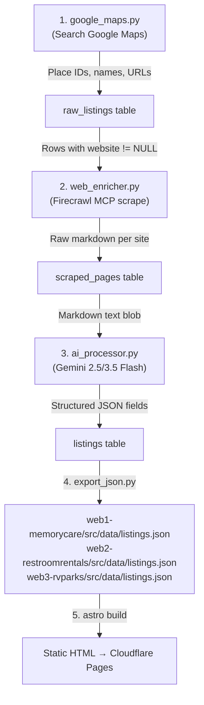
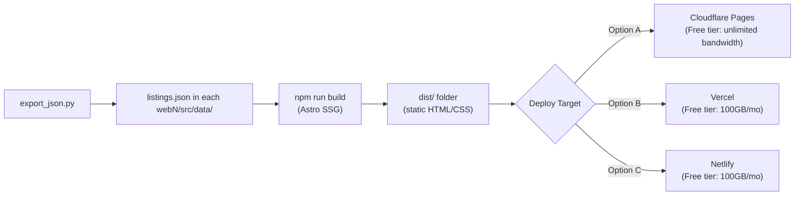

# Workspace Architecture Blueprint

This document contains the complete system design, directory structures, scraping pipelines, and individual website specifications for the Niche Directory project. Every feature, database schema, and layout configuration is documented here line-for-line.

---

## 1. Global System Overview

We are building a scalable, multi-site directory system. The core design principles are:
1. **Zero-Database Runtime:** To ensure maximum SEO speed, 100% Google lighthouse scores, and zero hosting costs, websites are compiled into static HTML at build time. The production sites do not run live databases.
2. **Local SQLite Engine:** Data collection, scraping, and AI enrichment are handled in a single central SQLite database (`pipeline/data/directory.db`). This database is only used during the ingestion and build phases.
3. **Programmatic Static Generation:** Our frontend builder compiles the static JSON/SQLite data into hundreds of pages at build-time using a Static Site Generator (Astro).

### Global Directory Layout
```text
e:/Claude/Workspaces/Niche Directory W/
├── .agents/                    # Custom AI rules and skill mappings
│   ├── AGENTS.md               # Workspace rules
│   └── skills.json             # Loaded custom skills
├── Manual/                     # Screenshots of initial niche market verification
├── architecture.md             # This file (source of truth)
├── pipeline/                   # Shared scraping & AI-enrichment engine
│   ├── data/
│   │   └── directory.db        # Master SQLite database (local only)
│   ├── scripts/
│   │   ├── google_maps.py      # Map search and metadata scraper
│   │   ├── web_enricher.py     # Site content downloader (using Firecrawl MCP/Playwright)
│   │   └── ai_processor.py     # LLM analyzer for extracting pricing/amenities
│   └── requirements.txt
├── web1-memorycare/            # Website 1 (Memory Care & Dementia Care Directory)
├── web2-restroomrentals/        # Website 2 (Luxury Restroom Trailer Directory)
└── web3-rvparks/               # Website 3 (Campgrounds with Verified Signal/Wi-Fi)
```

### 1.1 Manual Market Validation Findings (July 2026 Audit)

Based on a manual audit of Google search results for key niches in specific target locations:

1. **Memory Care Niche (Sarasota, FL / Mesa, AZ):**
   - **High Commercial Interest:** Active sponsored PPC ads and Google Maps pack ads (e.g., *SRG Senior Living*, *The Village at Ocotillo*). 
   - **Cost Transparency Gap:** Google's "People also ask" box indicates massive cost intent: *"How much does memory care cost in Sarasota?"*. Average starting costs hover around **$3,895/month**.
   - **Competitor Landscape:** National referral aggregators (*A Place for Mom*, *AssistedLiving.org*) dominate, but they lack direct, specialized comparisons. Forums/Reddit threads show users actively seeking peer pricing validation.

2. **Luxury Restroom Trailer Niche (Richardson, TX / McKinney, TX):**
   - **High Ticket Value:** Organic competitor snippet data discloses that luxury trailer rentals range from **$1,600 to $3,800** per event.
   - **Geographic Fragmentation:** Current organic results are dominated by DFW-wide suppliers (e.g., *Chemcans*, *Elegant Outhouse*) rather than hyper-local Richardson/McKinney pages.
   - **Competitor Landscape:** Wedding-specific sites (*The Knot*) rank, but fail to provide direct side-by-side trailer counts and pricing.

3. **RV Parks Niche (Glacier National Park, MT):**
   - **Aggregator Saturation:** General directories like *Good Sam* and *TripAdvisor* rank, but they lack technical filters for digital nomads (Wi-Fi speed, cell signals).
   - **Entity Trust:** Users are searching for concrete questions: *"What is the best campground to stay in at Glacier National park?"* and *"Is there boondocking near..."*.

---

## 2. Ingestion & AI Enrichment Pipeline Architecture

### 2.0 Pipeline Flow Diagram



### 2.1 Database Schema (SQLite: `pipeline/data/directory.db`)

All three niches share a single database file. Tables are prefixed by purpose, not niche — the `niche` column differentiates data rows.

---

#### Table: `raw_listings`
**Purpose:** Stores the initial raw data scraped from Google Maps. One row per business/place discovered.

```sql
CREATE TABLE IF NOT EXISTS raw_listings (
    id              INTEGER PRIMARY KEY AUTOINCREMENT,
    niche           TEXT    NOT NULL,                    -- 'memorycare' | 'restroomrentals' | 'rvparks'
    google_place_id TEXT    UNIQUE NOT NULL,             -- Google Maps Place ID (dedupe key)
    name            TEXT    NOT NULL,
    full_address    TEXT,                                -- Full formatted address string
    city            TEXT,
    state           TEXT,                                -- 2-letter US state code (e.g. 'FL')
    zip_code        TEXT,
    latitude        REAL,
    longitude       REAL,
    phone           TEXT,
    website         TEXT,                                -- Homepage URL (NULL if none listed)
    rating          REAL,                                -- Google Maps average rating (1.0–5.0)
    reviews_count   INTEGER DEFAULT 0,
    google_category TEXT,                                -- Primary Maps category (e.g. 'Memory care center')
    business_hours  TEXT,                                -- JSON string: {"Mon":"8AM-6PM", ...}
    photo_url       TEXT,                                -- First Google Maps photo URL (for thumbnail)
    scrape_source   TEXT    DEFAULT 'firecrawl',         -- 'outscraper' | 'firecrawl' | 'manual'
    scraped_at      TEXT    DEFAULT (datetime('now')),
    scrape_status   TEXT    DEFAULT 'pending'            -- 'pending' | 'scraped' | 'failed' | 'skipped'
);

CREATE INDEX idx_raw_niche_state ON raw_listings(niche, state);
CREATE INDEX idx_raw_niche_city  ON raw_listings(niche, city);
CREATE INDEX idx_raw_scrape_status ON raw_listings(scrape_status);
```

---

#### Table: `scraped_pages`
**Purpose:** Stores the raw HTML/Markdown content downloaded from each listing's website. Kept separate from `raw_listings` to avoid bloating the main table with multi-KB text blobs.

```sql
CREATE TABLE IF NOT EXISTS scraped_pages (
    id              INTEGER PRIMARY KEY AUTOINCREMENT,
    raw_listing_id  INTEGER NOT NULL REFERENCES raw_listings(id),
    url             TEXT    NOT NULL,                    -- The exact URL that was scraped
    page_markdown   TEXT,                                -- Full page content as Markdown (Firecrawl output)
    page_title      TEXT,                                -- <title> tag content
    word_count      INTEGER DEFAULT 0,                   -- For quality filtering (skip pages < 50 words)
    http_status     INTEGER,                             -- 200, 404, 503, etc.
    scraped_at      TEXT    DEFAULT (datetime('now')),
    scrape_status   TEXT    DEFAULT 'pending'            -- 'pending' | 'scraped' | 'failed' | 'blocked'
);

CREATE INDEX idx_pages_raw_id ON scraped_pages(raw_listing_id);
CREATE INDEX idx_pages_status ON scraped_pages(scrape_status);
```

---

#### Table: `listings`
**Purpose:** Stores the final AI-enriched data ready for JSON export and Astro static build. Each row is a production-ready listing that will become a page on the website.

```sql
CREATE TABLE IF NOT EXISTS listings (
    id                  INTEGER PRIMARY KEY AUTOINCREMENT,
    raw_listing_id      INTEGER NOT NULL REFERENCES raw_listings(id),
    niche               TEXT    NOT NULL,                -- Redundant for fast niche-filtered queries
    slug                TEXT    UNIQUE NOT NULL,         -- URL slug: 'sunrise-memory-care-sarasota-fl'
    display_name        TEXT    NOT NULL,                -- Clean display name
    city                TEXT    NOT NULL,
    state               TEXT    NOT NULL,
    zip_code            TEXT,
    full_address        TEXT,
    latitude            REAL,
    longitude           REAL,
    phone               TEXT,
    website             TEXT,
    rating              REAL,
    reviews_count       INTEGER DEFAULT 0,

    -- Common pricing fields (all niches)
    pricing_min         REAL,                            -- Lowest price found
    pricing_max         REAL,                            -- Highest price found
    pricing_period      TEXT,                            -- 'monthly' | 'per_event' | 'nightly' | 'per_donation'
    pricing_note        TEXT,                            -- Human-readable pricing caveat

    -- Common enrichment fields
    amenities_json      TEXT,                            -- JSON array: ["wheelchair_accessible", "outdoor_play"]
    ai_summary          TEXT,                            -- 2-3 sentence LLM summary of the business
    ai_pros_json        TEXT,                            -- JSON array of positive highlights
    ai_cons_json        TEXT,                            -- JSON array of negatives/warnings
    source_snippet      TEXT,                            -- Verbatim excerpt from website (for credibility)

    -- Niche-specific: memorycare
    dementia_certified      INTEGER,                    -- 0 or 1
    staff_to_resident_ratio TEXT,                        -- e.g. '1:6'
    monthly_fee_est         REAL,                        -- Estimated monthly cost
    medicaid_accepted       INTEGER,                    -- 0 or 1
    secure_wander_guard     INTEGER,                    -- 0 or 1
    memory_care_levels      TEXT,                        -- JSON: ["early_stage","mid_stage","late_stage"]
    respite_care_available  INTEGER,                    -- 0 or 1

    -- Niche-specific: restroomrentals
    stalls_count            INTEGER,
    climate_controlled      INTEGER,                    -- 0 or 1
    ada_compliant           INTEGER,                    -- 0 or 1
    rental_price_est        REAL,                        -- Per-event estimated cost
    delivery_radius_miles   INTEGER,
    suited_for_events_json  TEXT,                        -- JSON: ["weddings","festivals","construction"]
    has_running_water       INTEGER,                    -- 0 or 1
    has_flushing_toilets    INTEGER,                    -- 0 or 1

    -- Niche-specific: rvparks
    verizon_signal          TEXT,                        -- 'strong' | 'medium' | 'weak' | 'none' | NULL
    tmobile_signal          TEXT,
    att_signal              TEXT,
    wifi_available          INTEGER,                    -- 0 or 1
    wifi_speed_mbps         REAL,                        -- Measured or reported speed
    hookups_available       TEXT,                        -- JSON: ["full","water_electric","dry_camping"]
    nightly_rate            REAL,
    pet_friendly            INTEGER,                    -- 0 or 1
    coworking_space         INTEGER,                    -- 0 or 1
    max_rv_length_ft        INTEGER,

    -- Metadata
    enrichment_status   TEXT    DEFAULT 'pending',       -- 'pending' | 'enriched' | 'failed' | 'manual_review'
    enrichment_model    TEXT,                            -- 'gemini-2.5-flash' | 'manual'
    last_verified       TEXT    DEFAULT (datetime('now')),
    published           INTEGER DEFAULT 0               -- 0 = draft, 1 = live on site
);

CREATE INDEX idx_listings_niche_state ON listings(niche, state);
CREATE INDEX idx_listings_niche_city  ON listings(niche, city);
CREATE INDEX idx_listings_slug        ON listings(slug);
CREATE INDEX idx_listings_published   ON listings(published);
```

---

#### Table: `target_cities`
**Purpose:** Master list of target cities we will scrape for each niche. Controls the crawl scope.

```sql
CREATE TABLE IF NOT EXISTS target_cities (
    id              INTEGER PRIMARY KEY AUTOINCREMENT,
    niche           TEXT    NOT NULL,
    city            TEXT    NOT NULL,
    state           TEXT    NOT NULL,                    -- 2-letter code
    population      INTEGER,                            -- Approximate population
    median_income   INTEGER,                            -- Median household income (for commercial viability)
    priority        INTEGER DEFAULT 2,                  -- 1 = high, 2 = medium, 3 = low
    search_query    TEXT    NOT NULL,                    -- Exact Google Maps query to use
    scrape_status   TEXT    DEFAULT 'pending',           -- 'pending' | 'complete' | 'in_progress'
    listings_found  INTEGER DEFAULT 0,
    UNIQUE(niche, city, state)
);
```

---

### 2.2 Target Cities Per Niche

#### Niche 1: Memory Care (`memorycare`)
**Strategy:** Target retirement-heavy suburbs in FL, AZ, TX where the 65+ population is 20%+ and median income is $50k+. These are places where adult children are Googling "*memory care near [city]*" for their parents.

| Priority | City | State | Pop. | Search Query |
|----------|------|-------|------|-------------|
| 1 | Sarasota | FL | 57,000 | "memory care facilities in Sarasota FL" |
| 1 | Mesa | AZ | 508,000 | "memory care in Mesa AZ" |
| 1 | The Villages | FL | 80,000 | "dementia care The Villages FL" |
| 1 | Sun City | AZ | 39,000 | "memory care Sun City AZ" |
| 1 | Cape Coral | FL | 204,000 | "memory care Cape Coral FL" |
| 2 | Clearwater | FL | 117,000 | "memory care facilities Clearwater FL" |
| 2 | Scottsdale | AZ | 241,000 | "memory care Scottsdale AZ" |
| 2 | Lakeland | FL | 112,000 | "memory care Lakeland FL" |
| 2 | Gilbert | AZ | 267,000 | "memory care Gilbert AZ" |
| 2 | Ocala | FL | 63,000 | "dementia care Ocala FL" |
| 2 | Georgetown | TX | 75,000 | "memory care Georgetown TX" |
| 2 | Port St. Lucie | FL | 217,000 | "memory care Port St Lucie FL" |
| 3 | Venice | FL | 25,000 | "memory care Venice FL" |
| 3 | Peoria | AZ | 190,000 | "memory care Peoria AZ" |
| 3 | Boynton Beach | FL | 80,000 | "memory care Boynton Beach FL" |

#### Niche 2: Luxury Restroom Trailers (`restroomrentals`)
**Strategy:** Target affluent suburbs near major metros with high wedding/event venue density. Focus on DFW, Nashville, Austin, Charlotte corridors where outdoor weddings are common.

| Priority | City | State | Pop. | Search Query |
|----------|------|-------|------|-------------|
| 1 | McKinney | TX | 199,000 | "luxury restroom trailer rental McKinney TX" |
| 1 | Richardson | TX | 121,000 | "portable restroom trailer rental Richardson TX" |
| 1 | Franklin | TN | 83,000 | "luxury restroom trailer rental Franklin TN" |
| 1 | Dripping Springs | TX | 5,000 | "restroom trailer rental Dripping Springs TX" |
| 1 | Huntersville | NC | 60,000 | "luxury portable restroom Huntersville NC" |
| 2 | Frisco | TX | 210,000 | "restroom trailer rental Frisco TX" |
| 2 | Brentwood | TN | 44,000 | "luxury restroom trailer Brentwood TN" |
| 2 | Georgetown | TX | 75,000 | "portable restroom trailer Georgetown TX" |
| 2 | Cornelius | NC | 32,000 | "restroom trailer rental Cornelius NC" |
| 2 | Leander | TX | 75,000 | "restroom trailer rental Leander TX" |
| 2 | Murfreesboro | TN | 152,000 | "luxury portable restroom Murfreesboro TN" |
| 3 | Wimberley | TX | 3,000 | "restroom trailer rental Wimberley TX" |
| 3 | Nolensville | TN | 14,000 | "portable restroom trailer Nolensville TN" |
| 3 | Weddington | NC | 12,000 | "restroom trailer rental Weddington NC" |

#### Niche 3: RV Parks with Verified Signal (`rvparks`)
**Strategy:** Target regions around National Parks and major RV corridors where digital nomads/remote workers search for verified cell/Wi-Fi connectivity before booking.

| Priority | City/Region | State | Pop. | Search Query |
|----------|-------------|-------|------|-------------|
| 1 | West Glacier | MT | 400 | "RV parks near Glacier National Park" |
| 1 | Moab | UT | 5,300 | "RV parks with wifi Moab UT" |
| 1 | Sedona | AZ | 10,000 | "RV parks near Sedona AZ" |
| 1 | Pigeon Forge | TN | 6,300 | "campgrounds near Great Smoky Mountains" |
| 1 | Estes Park | CO | 6,000 | "RV parks near Rocky Mountain National Park" |
| 2 | Springdale | UT | 600 | "RV parks near Zion National Park" |
| 2 | Tusayan | AZ | 600 | "campgrounds near Grand Canyon" |
| 2 | Bar Harbor | ME | 5,800 | "RV parks near Acadia National Park" |
| 2 | Kanab | UT | 5,000 | "RV parks with cell service Kanab UT" |
| 2 | Townsend | TN | 500 | "campgrounds with wifi Townsend TN" |
| 2 | Custer | SD | 2,100 | "RV parks near Mount Rushmore" |
| 3 | Cooke City | MT | 140 | "campgrounds Cooke City MT" |
| 3 | Gardiner | MT | 900 | "RV parks near Yellowstone" |
| 3 | Valle | AZ | 600 | "campgrounds near Grand Canyon South Rim" |

---

### 2.3 Crawling Configuration

#### Script 1: `google_maps.py`
**Input:** Reads `target_cities` table rows where `scrape_status = 'pending'`.
**Method:** Uses Firecrawl MCP (`firecrawl_scrape`) to scrape Google Maps search result pages, OR Outscraper API if Firecrawl is rate-limited.
**Output:** Inserts rows into `raw_listings`.

```python
# Pseudocode configuration
SCRAPER_CONFIG = {
    "tool": "firecrawl_scrape",          # Primary scraping engine
    "fallback_tool": "outscraper_api",   # Fallback if Firecrawl blocks Maps
    "max_results_per_query": 20,         # Google Maps typically shows ~20 results
    "delay_between_queries_sec": 5,      # Polite crawl delay
    "retry_on_failure": 3,
    "fields_to_extract": [
        "name", "address", "phone", "website", "rating",
        "reviews_count", "place_id", "category", "hours", "photo_url"
    ],
    "dedup_key": "google_place_id",      # Skip if already exists in raw_listings
}
```

#### Script 2: `web_enricher.py`
**Input:** Reads `raw_listings` rows where `scrape_status = 'scraped'` AND `website IS NOT NULL`.
**Method:** Uses Firecrawl MCP (`firecrawl_scrape`) to fetch each listing's website and convert it to clean Markdown.
**Output:** Inserts rows into `scraped_pages`.

```python
ENRICHER_CONFIG = {
    "tool": "firecrawl_scrape",
    "output_format": "markdown",         # Firecrawl's markdown output mode
    "max_page_size_kb": 500,             # Skip pages larger than 500KB
    "timeout_sec": 30,
    "skip_if_word_count_below": 50,      # Skip near-empty pages
    "delay_between_scrapes_sec": 3,
    "pages_to_scrape_per_site": 3,       # Homepage + Pricing page + About page
    "url_patterns_to_follow": [
        "*pricing*", "*rates*", "*cost*", "*fees*",
        "*amenities*", "*services*", "*about*",
        "*contact*", "*faq*"
    ],
}
```

#### Script 3: `ai_processor.py`
**Input:** Reads `scraped_pages` rows where `scrape_status = 'scraped'` AND the matching `raw_listings.niche`.
**Method:** Sends page markdown to Gemini 2.5/3.5 Flash API with a niche-specific prompt template.
**Output:** Inserts/updates rows in `listings`.

```python
AI_PROCESSOR_CONFIG = {
    "model": "gemini-3.5-flash",
    "thinking_budget": 1024,
    "max_output_tokens": 4096,
    "batch_size": 10,                    # Process 10 listings per batch
    "delay_between_batches_sec": 2,
    "retry_on_failure": 2,
}
```

---

### 2.4 AI Extraction Prompt Templates

Each niche gets a tailored prompt that instructs the Gemini model to extract structured data from raw webpage Markdown.

#### Memory Care Prompt
```
You are a data extraction assistant. Given the following webpage content from a memory care facility's website, extract the following fields as a JSON object. If a field is not mentioned, use null. Do not infer or guess values — only extract what is explicitly stated or clearly implied.

Fields to extract:
- "pricing_min": number (lowest monthly cost mentioned, in USD)
- "pricing_max": number (highest monthly cost mentioned, in USD)
- "pricing_period": "monthly" (always monthly for this niche)
- "pricing_note": string (any caveats like "starting from" or "depends on level of care")
- "dementia_certified": boolean (does the facility mention Alzheimer's/dementia certification?)
- "staff_to_resident_ratio": string (e.g. "1:6")
- "medicaid_accepted": boolean (does it mention Medicaid or Medicaid waiver?)
- "secure_wander_guard": boolean (mentions secure memory unit, wander guard, locked doors?)
- "memory_care_levels": array of strings (e.g. ["early_stage", "mid_stage", "late_stage"])
- "respite_care_available": boolean
- "amenities": array of strings (e.g. ["garden", "art_therapy", "music_therapy", "pet_therapy"])
- "summary": string (2-3 sentence summary of what this facility offers)
- "pros": array of strings (up to 3 positive highlights)
- "cons": array of strings (up to 2 negatives or warnings)
- "source_snippet": string (a single verbatim sentence from the website that proves pricing or care level)

Webpage content:
---
{page_markdown}
---

Respond ONLY with valid JSON. No explanation.
```

#### Luxury Restroom Trailer Prompt
```
You are a data extraction assistant. Given the following webpage content from a portable restroom trailer rental company's website, extract the following fields as a JSON object. If a field is not mentioned, use null.

Fields to extract:
- "pricing_min": number (lowest rental price mentioned, in USD)
- "pricing_max": number (highest rental price mentioned, in USD)
- "pricing_period": "per_event" (always per_event for this niche)
- "pricing_note": string (e.g. "delivery fee extra", "minimum 4-hour rental")
- "stalls_count": number (number of stalls in largest trailer)
- "climate_controlled": boolean (air conditioning/heating mentioned?)
- "ada_compliant": boolean (ADA-accessible unit mentioned?)
- "delivery_radius_miles": number (how far they deliver)
- "has_running_water": boolean
- "has_flushing_toilets": boolean
- "suited_for_events": array of strings (e.g. ["weddings", "festivals", "construction", "corporate"])
- "amenities": array of strings (e.g. ["vanity_mirrors", "music_system", "hand_towels", "fresh_flowers"])
- "summary": string (2-3 sentence summary)
- "pros": array of strings (up to 3)
- "cons": array of strings (up to 2)
- "source_snippet": string (verbatim sentence proving pricing or service area)

Webpage content:
---
{page_markdown}
---

Respond ONLY with valid JSON. No explanation.
```

#### RV Parks Prompt
```
You are a data extraction assistant. Given the following webpage content from an RV park or campground's website, extract the following fields as a JSON object. If a field is not mentioned, use null. Pay special attention to any mentions of cellular signal quality, Wi-Fi, or internet connectivity.

Fields to extract:
- "pricing_min": number (lowest nightly rate, in USD)
- "pricing_max": number (highest nightly rate, in USD)
- "pricing_period": "nightly"
- "pricing_note": string (e.g. "weekly/monthly discounts available", "peak season rates")
- "verizon_signal": "strong" | "medium" | "weak" | "none" | null
- "tmobile_signal": "strong" | "medium" | "weak" | "none" | null
- "att_signal": "strong" | "medium" | "weak" | "none" | null
- "wifi_available": boolean
- "wifi_speed_mbps": number (if a speed is mentioned)
- "hookups_available": array of strings (e.g. ["full_hookup", "water_electric", "dry_camping"])
- "pet_friendly": boolean
- "coworking_space": boolean (dedicated work area, business center?)
- "max_rv_length_ft": number
- "nightly_rate": number (most common rate)
- "amenities": array of strings (e.g. ["pool", "laundry", "dump_station", "propane", "store"])
- "summary": string (2-3 sentence summary)
- "pros": array of strings (up to 3)
- "cons": array of strings (up to 2)
- "source_snippet": string (verbatim sentence about connectivity or pricing)

Webpage content:
---
{page_markdown}
---

Respond ONLY with valid JSON. No explanation.
```

---

### 2.5 JSON Export Format (for Astro Static Build)

Script `export_json.py` queries the `listings` table where `published = 1` and exports niche-filtered JSON files into each website's `src/data/` directory.

#### Output Path Convention
```
web1-memorycare/src/data/listings.json
web2-restroomrentals/src/data/listings.json
web3-rvparks/src/data/listings.json
```

#### JSON Structure (per listing)
```json
{
  "slug": "sunrise-memory-care-sarasota-fl",
  "displayName": "Sunrise Memory Care",
  "city": "Sarasota",
  "state": "FL",
  "zipCode": "34236",
  "fullAddress": "1234 Sunset Blvd, Sarasota, FL 34236",
  "latitude": 27.3364,
  "longitude": -82.5307,
  "phone": "(941) 555-1234",
  "website": "https://sunrisememorycare.com",
  "rating": 4.6,
  "reviewsCount": 89,
  "pricingMin": 3500,
  "pricingMax": 6200,
  "pricingPeriod": "monthly",
  "pricingNote": "Starting from $3,500; varies by level of care",
  "amenities": ["garden", "art_therapy", "music_therapy", "pet_therapy"],
  "aiSummary": "Sunrise Memory Care is a boutique dementia care facility...",
  "aiPros": ["Small resident-to-staff ratio of 1:5", "Beautiful secured garden"],
  "aiCons": ["No Medicaid accepted", "Waitlist of 2-3 months"],
  "sourceSnippet": "Our monthly rates start at $3,500 for early-stage care.",
  "nicheFields": {
    "dementiaCertified": true,
    "staffToResidentRatio": "1:5",
    "monthlyFeeEst": 3500,
    "medicaidAccepted": false,
    "secureWanderGuard": true,
    "memoryCareLevels": ["early_stage", "mid_stage"],
    "respiteCareAvailable": true
  },
  "lastVerified": "2026-07-11T12:00:00Z"
}
```

---

### 2.6 Build-to-Deploy Workflow



**Deployment Commands (per site):**
```bash
# Build
cd web1-memorycare && npm run build

# Deploy to Cloudflare Pages (recommended — zero cost)
npx wrangler pages deploy dist/ --project-name=memorycare-directory

# OR deploy to Vercel
cd web1-memorycare && npx vercel --prod

# OR deploy to Netlify
cd web1-memorycare && npx netlify deploy --prod --dir=dist
```

**Rebuild Cadence:**
- **Weekly:** Re-run `web_enricher.py` + `ai_processor.py` on listings where `last_verified` is older than 30 days.
- **Monthly:** Re-run `google_maps.py` on all target cities to discover new businesses.
- **On-Demand:** After manually adding a listing via `pipeline/scripts/manual_add.py`.

---

## 3. Website 1: web1-memorycare (Memory Care & Dementia Care Directory)

* **Directory Folder:** `web1-memorycare/`
* **Domain (planned):** `memorycarefinder.directory` or similar
* **Target Audience:** Adult children (ages 40–65) searching for memory care facilities for aging parents.
* **Niche-Specific Columns:** Defined in `listings` table (Section 2.1) under `-- Niche-specific: memorycare`

### 3.1 SEO Strategy

**Primary Keywords (Head Terms):**
| Keyword | Est. Monthly Volume | CPC | Difficulty |
|---------|-------------------|-----|------------|
| "memory care near me" | 12,100 | $18.50 | High (aim for city pages) |
| "memory care facilities in [city] [state]" | 300–800 per city | $13–$22 | Medium |
| "dementia care cost [city]" | 100–400 per city | $15–$20 | Low |
| "memory care vs assisted living [city]" | 200–600 | $10–$14 | Low |

**Long-Tail Keywords (target with facility detail pages):**
- "[facility name] reviews"
- "[facility name] cost"
- "best memory care in [city] [state]"
- "memory care that accepts medicaid in [city]"

**Content Strategy:**
- Each city page answers: "How much does memory care cost in [city]?" with a pricing comparison table.
- Each facility page includes a verbatim pricing quote from the website (the `source_snippet` field).
- Blog section (Phase 2): "Memory Care vs. Assisted Living: What's the Difference?" and similar informational intent articles.

**Structured Data Markup (per facility page):**
```json
{
  "@context": "https://schema.org",
  "@type": "LocalBusiness",
  "additionalType": "HealthAndBeautyBusiness",
  "name": "{displayName}",
  "address": {
    "@type": "PostalAddress",
    "streetAddress": "{street}",
    "addressLocality": "{city}",
    "addressRegion": "{state}",
    "postalCode": "{zipCode}"
  },
  "telephone": "{phone}",
  "url": "{website}",
  "aggregateRating": {
    "@type": "AggregateRating",
    "ratingValue": "{rating}",
    "reviewCount": "{reviewsCount}"
  },
  "priceRange": "${pricingMin}–${pricingMax}/month",
  "geo": {
    "@type": "GeoCoordinates",
    "latitude": "{latitude}",
    "longitude": "{longitude}"
  }
}
```

### 3.2 Monetization

| Channel | Revenue Model | Est. Monthly Revenue (at 5k visitors) |
|---------|--------------|--------------------------------------|
| Display Ads (Mediavine/Raptive) | CPM on informational pages | $75–$150 |
| Featured Listings | Facilities pay $99–$299/month for highlighted placement | $200–$600 |
| Lead Referral Fees | $25–$75 per qualified inquiry sent to a facility | $300–$900 |
| Affiliate Links | Senior care products (medical alert systems, mobility aids) | $50–$100 |

**Total Estimated Monthly at 5k visitors: $625–$1,750**

### 3.3 Page Requirements

#### Homepage (`index.astro`)
- Hero: "Find Memory Care Facilities Near You — With Real Pricing"
- State selector grid (all 50 US states with listing counts)
- "How It Works" section explaining our data verification process
- Top 5 most-searched cities quick links
- FAQ section targeting "People Also Ask" snippets

#### State Page (`[state]/index.astro`)
- H1: "Memory Care Facilities in {State Name}"
- City cards with listing count and average monthly cost per city
- State-level pricing overview: "Average memory care cost in {State}: ${avg}/month"
- Breadcrumb: Home → {State}

#### City Page (`[state]/[city].astro`)
- H1: "Best Memory Care Facilities in {City}, {State}"
- Comparison table: facility name, monthly cost range, rating, Medicaid accepted (Y/N), dementia certified (Y/N)
- Side-by-side pricing chart
- "People Also Ask" FAQ section
- Breadcrumb: Home → {State} → {City}

#### Facility Page (`facilities/[slug].astro`)
- H1: "{Facility Name} – Memory Care in {City}, {State}"
- Pricing card with verified cost range and source snippet
- Amenity badges (garden, art therapy, pet therapy, etc.)
- Pros/Cons list from AI extraction
- Google Maps embed
- Contact CTA (phone click-to-call + inquiry form)
- Breadcrumb: Home → {State} → {City} → {Facility Name}

### 3.4 File Structure
```text
web1-memorycare/
├── src/
│   ├── data/
│   │   └── listings.json         # Auto-generated by export_json.py
│   ├── layouts/
│   │   └── Layout.astro          # Main shell (meta tags, LocalBusiness Schema, analytics)
│   ├── components/
│   │   ├── Card.astro            # Facility card for list views
│   │   ├── AmenityBadges.astro   # Visual badges (Secure Garden, Wander Guard, etc.)
│   │   ├── PricingCard.astro     # Verified pricing display with source citation
│   │   ├── ComparisonTable.astro # Side-by-side city comparison table
│   │   ├── ContactForm.astro     # Lead gen inquiry form
│   │   ├── Breadcrumb.astro      # SEO breadcrumb navigation
│   │   ├── FAQ.astro             # Expandable FAQ section (for PAA snippets)
│   │   └── MapEmbed.astro        # Google Maps iframe embed
│   └── pages/
│       ├── index.astro           # Homepage with state selector
│       ├── [state]/
│       │   ├── index.astro       # State overview with city cards
│       │   └── [city].astro      # City comparison table
│       └── facilities/
│           └── [slug].astro      # Individual facility profile
├── public/
│   ├── favicon.ico
│   ├── robots.txt
│   └── sitemap-index.xml         # Auto-generated by @astrojs/sitemap
├── astro.config.mjs
├── package.json
└── tsconfig.json
```

---

## 4. Website 2: web2-restroomrentals (Luxury Restroom Trailer Directory)

* **Directory Folder:** `web2-restroomrentals/`
* **Domain (planned):** `luxuryrestroomrentals.com` or similar
* **Target Audience:** Event planners, wedding coordinators, corporate event organizers, and construction site managers.
* **Niche-Specific Columns:** Defined in `listings` table (Section 2.1) under `-- Niche-specific: restroomrentals`

### 4.1 SEO Strategy

**Primary Keywords:**
| Keyword | Est. Monthly Volume | CPC | Difficulty |
|---------|-------------------|-----|------------|
| "luxury restroom trailer rental near me" | 1,600 | $8–$15 | Low |
| "portable restroom trailer rental [city]" | 200–500 per city | $6–$12 | Low |
| "luxury portable restroom for weddings" | 900 | $10–$18 | Medium |
| "restroom trailer rental cost" | 720 | $8–$14 | Low |

**Long-Tail Keywords:**
- "how much does a restroom trailer cost for a wedding"
- "portable bathroom trailer rental [city] [state]"
- "luxury porta potty rental near me"
- "restroom trailer with AC near [city]"

**Content Strategy:**
- Each city page answers: "How much does a restroom trailer rental cost in [city]?"
- Each supplier page shows stall count, ADA compliance, and delivery radius.
- Blog section (Phase 2): "Luxury Restroom Trailer vs. Standard Porta-Potty: Wedding Planning Guide"

**Structured Data Markup (per supplier page):**
```json
{
  "@context": "https://schema.org",
  "@type": "LocalBusiness",
  "additionalType": "RentalAgency",
  "name": "{displayName}",
  "areaServed": {
    "@type": "GeoCircle",
    "geoMidpoint": { "@type": "GeoCoordinates", "latitude": "{lat}", "longitude": "{lng}" },
    "geoRadius": "{deliveryRadiusMiles} mi"
  },
  "priceRange": "${pricingMin}–${pricingMax}/event"
}
```

### 4.2 Monetization

| Channel | Revenue Model | Est. Monthly Revenue (at 3k visitors) |
|---------|--------------|--------------------------------------|
| Lead Referral Fees | $50–$150 per qualified quote request | $400–$1,200 |
| Featured Listings | Suppliers pay $149–$499/month for top placement | $300–$1,000 |
| Display Ads | CPM on informational pages | $30–$60 |
| Affiliate Links | Event planning tools, tent/canopy rentals | $25–$75 |

**Total Estimated Monthly at 3k visitors: $755–$2,335**

### 4.3 Page Requirements

#### Homepage (`index.astro`)
- Hero: "Find Luxury Restroom Trailers for Your Event — Compare Prices Instantly"
- Event type selector: Weddings | Corporate | Festivals | Construction
- State/city search bar
- Top suppliers carousel

#### City Page (`[state]/[city].astro`)
- H1: "Luxury Restroom Trailer Rentals in {City}, {State}"
- Supplier comparison table: name, stalls, price range, ADA, climate control
- "Get a Free Quote" CTA button per supplier
- Breadcrumb: Home → {State} → {City}

#### Supplier Page (`suppliers/[slug].astro`)
- H1: "{Supplier Name} – Restroom Trailers in {City}, {State}"
- Fleet inventory cards (stall count, features per trailer)
- Pricing breakdown with source citation
- Delivery radius map
- Quote request form
- Breadcrumb: Home → {State} → {City} → {Supplier Name}

### 4.4 File Structure
```text
web2-restroomrentals/
├── src/
│   ├── data/
│   │   └── listings.json         # Auto-generated by export_json.py
│   ├── layouts/
│   │   └── Layout.astro          # Page layout wrapper with schema markup
│   ├── components/
│   │   ├── Card.astro            # Supplier listing card
│   │   ├── FleetCard.astro       # Individual trailer unit card
│   │   ├── QuoteRequest.astro    # B2B lead gen quote form
│   │   ├── ComparisonTable.astro # Side-by-side supplier comparison
│   │   ├── DeliveryMap.astro     # Delivery radius visualization
│   │   ├── Breadcrumb.astro      # SEO breadcrumb
│   │   └── FAQ.astro             # Expandable FAQ
│   └── pages/
│       ├── index.astro           # Landing page with event type selector
│       ├── [state]/
│       │   └── [city].astro      # Local supplier comparison
│       └── suppliers/
│           └── [slug].astro      # Supplier detail with fleet inventory
├── public/
│   ├── favicon.ico
│   ├── robots.txt
│   └── sitemap-index.xml
├── astro.config.mjs
├── package.json
└── tsconfig.json
```

---

## 5. Website 3: web3-rvparks (Campgrounds with Verified Wi-Fi & Cell Signals)

* **Directory Folder:** `web3-rvparks/`
* **Domain (planned):** `campconnected.com` or similar
* **Target Audience:** Digital nomads, remote workers, and full-time RVers who need reliable internet.
* **Niche-Specific Columns:** Defined in `listings` table (Section 2.1) under `-- Niche-specific: rvparks`

### 5.1 SEO Strategy

**Primary Keywords:**
| Keyword | Est. Monthly Volume | CPC | Difficulty |
|---------|-------------------|-----|------------|
| "RV parks with wifi near me" | 2,400 | $3–$6 | Low |
| "campgrounds with cell service near [park]" | 300–800 | $2–$5 | Low |
| "best RV parks for remote work" | 1,300 | $4–$8 | Medium |
| "RV parks near [national park]" | 1,000–5,000 | $3–$7 | Medium |

**Long-Tail Keywords:**
- "does [park name] have wifi"
- "cell signal at [campground name]"
- "RV parks with starlink friendly"
- "best campgrounds for working remotely near [national park]"

**Content Strategy:**
- Each park page shows carrier-by-carrier signal strength (Verizon/T-Mobile/AT&T)
- Each region page shows a signal coverage heatmap (Phase 2)
- Blog section: "Best RV Parks for Remote Workers Near [National Park]" guides

**Structured Data Markup (per park page):**
```json
{
  "@context": "https://schema.org",
  "@type": "Campground",
  "name": "{displayName}",
  "address": { "@type": "PostalAddress", "addressLocality": "{city}", "addressRegion": "{state}" },
  "amenityFeature": [
    { "@type": "LocationFeatureSpecification", "name": "Wi-Fi", "value": "{wifiAvailable}" },
    { "@type": "LocationFeatureSpecification", "name": "Full Hookups", "value": true }
  ],
  "priceRange": "${pricingMin}–${pricingMax}/night",
  "petsAllowed": "{petFriendly}"
}
```

### 5.2 Monetization

| Channel | Revenue Model | Est. Monthly Revenue (at 8k visitors) |
|---------|--------------|--------------------------------------|
| Affiliate Links (Starlink, WeBoost, Verizon hotspots) | Commission per sale ($15–$50) | $200–$600 |
| Display Ads (Mediavine/Raptive) | CPM on high-traffic park pages | $120–$250 |
| Featured Listings | Parks pay $49–$149/month for premium placement | $150–$450 |
| Campground Booking Referrals | $5–$15 per booking click-through | $100–$300 |

**Total Estimated Monthly at 8k visitors: $570–$1,600**

### 5.3 Page Requirements

#### Homepage (`index.astro`)
- Hero: "Find RV Parks with Verified Cell Signal & Wi-Fi"
- National Park region selector (interactive map or grid)
- Carrier filter toggle (Verizon / T-Mobile / AT&T)
- "Top Remote-Work-Friendly Parks" featured section

#### Region Page (`[state]/[city].astro`)
- H1: "RV Parks Near {Region/Park Name} with Cell Service"
- Park comparison table: name, signal bars per carrier, wifi speed, nightly rate, hookups
- Signal strength legend
- Breadcrumb: Home → {State} → {Region}

#### Park Page (`parks/[slug].astro`)
- H1: "{Park Name} – Cell Signal & Wi-Fi Report"
- Signal dashboard: 3-carrier bar chart (Verizon/T-Mobile/AT&T)
- Wi-Fi speed indicator (if available)
- Pricing card with nightly/weekly/monthly rates
- Amenity badges (pool, laundry, dump station, pet friendly)
- Affiliate product recommendations (cell boosters, Starlink kits)
- User signal report form (Phase 2: crowdsourced verification)
- Breadcrumb: Home → {State} → {Region} → {Park Name}

### 5.4 File Structure
```text
web3-rvparks/
├── src/
│   ├── data/
│   │   └── listings.json         # Auto-generated by export_json.py
│   ├── layouts/
│   │   └── Layout.astro          # Layout with mobile-first viewport
│   ├── components/
│   │   ├── Card.astro            # Park card with carrier signal indicators
│   │   ├── SignalDashboard.astro  # 3-carrier signal strength visualization
│   │   ├── WifiSpeed.astro       # Wi-Fi speed meter/indicator
│   │   ├── PricingCard.astro     # Nightly/weekly/monthly rate display
│   │   ├── AmenityBadges.astro   # Pool, laundry, hookups, pets badges
│   │   ├── AffiliateCard.astro   # Product recommendations (Starlink, boosters)
│   │   ├── ComparisonTable.astro # Region-level park comparison
│   │   ├── Breadcrumb.astro      # SEO breadcrumb
│   │   └── FAQ.astro             # Expandable FAQ
│   └── pages/
│       ├── index.astro           # Homepage with region selector + carrier filter
│       ├── [state]/
│       │   └── [city].astro      # Regional park comparison
│       └── parks/
│           └── [slug].astro      # Individual park signal report
├── public/
│   ├── favicon.ico
│   ├── robots.txt
│   └── sitemap-index.xml
├── astro.config.mjs
├── package.json
└── tsconfig.json
```

---

## 6. Revenue Projection Summary

| Site | Domain | Month 3 (Est.) | Month 6 (Est.) | Month 12 (Est.) |
|------|--------|---------------|----------------|-----------------|
| web1-memorycare | memorycarefinder.directory | $50–$150 | $300–$800 | $625–$1,750 |
| web2-restroomrentals | luxuryrestroomrentals.com | $30–$100 | $200–$600 | $755–$2,335 |
| web3-rvparks | campconnected.com | $40–$120 | $250–$700 | $570–$1,600 |
| **Portfolio Total** | | **$120–$370** | **$750–$2,100** | **$1,950–$5,685** |

**Key Assumptions:**
- Organic traffic growth follows typical programmatic SEO curve (3-6 months to index, 6-12 months to rank).
- Lead referral fees kick in at Month 4+ once facilities/suppliers notice inbound traffic.
- Featured listing revenue starts at Month 6+ after proving traffic via analytics screenshots.
- All estimates assume zero paid advertising spend.

---

## 7. Technical Stack Summary

| Layer | Technology | Why |
|-------|-----------|-----|
| **Static Site Generator** | Astro 5.x | Zero-JS output, 100/100 Lighthouse, free hosting |
| **Styling** | Vanilla CSS (no Tailwind) | Maximum control, smallest bundle, no build dependency |
| **Data Pipeline** | Python 3.12 + SQLite | Local-only, zero server costs, easy to script |
| **Scraping** | Firecrawl MCP + Playwright MCP | Handles JS-heavy sites, clean markdown output |
| **AI Extraction** | Gemini 3.5 Flash API | Thinking-enabled reasoning, cheapest per-token cost, structured JSON output |
| **Hosting** | Cloudflare Pages (primary) | Free tier, unlimited bandwidth, global CDN |
| **Domain Registrar** | Cloudflare Registrar | At-cost pricing ($8–$12/year per .com) |
| **Analytics** | Plausible Analytics (self-hosted) or Umami | Privacy-friendly, no cookie banners needed |
| **Sitemap** | @astrojs/sitemap | Auto-generates XML sitemaps at build time |
